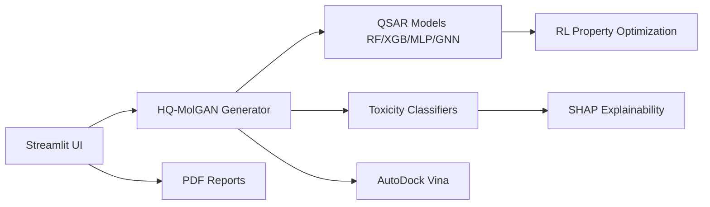

# Project Portfolio Master Inventory

**Workspace:** `/Users/kumar/Documents/projects`  
**Generated:** Read-only analysis (no project files modified)  
**Scope:** Top-level `projects/` folders + `projects/new projects/` subfolders  
**Excluded from inventory:** `cloud-projects/` (deployment scripts/logs only), empty `frontend/`, empty `new projects/satya sadhana/`, empty `new projects/externify/` (git shell only)

---

# Duplicate Projects Found

The following folders were analyzed as copies, forks, renamed iterations, or thin wrappers. **One canonical entry** is documented below; duplicates are listed for traceability only.

| Canonical project | Duplicate / related folders | Reason merged |
|-------------------|----------------------------|---------------|
| **Externify (Production Monorepo)** | `Externify/` (CRA wrapper only), `new projects/externify/` (no source, `.git` only) | `externify main/` contains `ai-service`, backend deployment docs, security checklists |
| **Pharmaceutical Regulatory Compliance Agent** | `new projects/Pharmaceutical Regulatory Compliance Agent/` | Same Phase 1–3 RAG agent; identical stack (`chromadb`, `backend/main.py`) |
| **Super AI Prompts (MERN)** | `chatgpt-prompts/` | Older Vite SPA; `new projects/prompts/` is full MERN with versioned API |
| **Quantum-Enhanced Chest X-Ray (Diffusion)** | `new projects/chest/` | Overlapping `torch`, `diffusers`, `streamlit`; top-level has quantum/PQC narrative + multiple entry apps |
| **ProjectKaro** | `pk ag/` | Wrapper folder pointing at embedded `projectkaro/` |
| **Blog Generator (CRA)** | `News/` | Same Create React App scaffold; different folder name only |
| **Personal portfolio (CRA visiting card)** | `digital_visiting_card/`, `dasa akhil/` | CRA personal sites (`akshay/`, `akhil/` subfolders); distinct from Vite `akshay/` at top level |
| **Anemia ML Pipeline** | `new projects/sridevi/` | Only `anemia_hg_analysis.ipynb` — subset of full `anemia/` pipeline |
| **Epilepsy research (papers)** | `new projects/GAT_Epilepsy/` | LaTeX/paper assets; runnable app documented under **MRI Multimodal GNN** |

**Note:** `W Skin/` was referenced in earlier workspace notes but **does not exist** in the current tree. Skin work is under **`Skin Disease Prediction ViT/`** only.

---

# Project Ranking

Rankings reflect **deduplicated** projects. Scores consider complexity, engineering depth, documentation, deployment signals, research rigor, and portfolio uniqueness.

## Combined ranking (all audiences)

| Rank | Project | Category | Reason |
|------|---------|----------|--------|
| 1 | Hybrid Quantum GAN Drug Discovery | ML / Research / MLOps | End-to-end cheminformatics: quantum GAN, QSAR, toxicity, docking, RL, SHAP, Streamlit |
| 2 | Skin Disease Prediction ViT (SkinCare AI) | CV / LLM / Full stack | Dual ViT+CNN models (documented 92.6%/91.8%), FastAPI, Groq medical chat |
| 3 | RXShield AI (`new projects/medical`) | Full stack / HealthTech | Next.js + Express/Prisma + FastAPI risk engine monorepo |
| 4 | Ecommerce Product Recommendation | ML / Full stack | NCF + Q-learning hybrid recommender; FastAPI + Streamlit |
| 5 | Externify (Production Monorepo) | Full stack / SaaS | Multi-service, AWS deployment guides, security checklists |
| 6 | MRI Multimodal Epilepsy GNN | ML / Research | EEG+MRI graph fusion, Streamlit, trained artifacts |
| 7 | Pharmaceutical Regulatory Compliance Agent | LLM / RAG / Enterprise | ChromaDB RAG, compliance agent, FastAPI demo UI |
| 8 | Soil NRI | GeoML / Streamlit | XGBoost + TensorFlow + Groq; multi-district soil models |
| 9 | BookMyReels | Full stack / Product | React 19 + Express TS + MongoDB + Cashfree payments |
| 10 | Quantum-Enhanced Chest X-Ray | CV / Quantum ML | Text-to-chest-X-ray diffusion + PQC encoder |
| 11 | AD-14 Injury CNN + Hospital Routing | CV / Healthcare | Emergency injury severity + hospital recommendation |
| 12 | Deepfake Detection | CV / API | EfficientNet-B4 (+ optional ViT) FastAPI service |
| 13 | ProjectKaro | Full stack / Product | Next.js 14 marketing + forms (projectkaro.com) |
| 14 | Diabetes Fundus Multi-Task | CV / Research | TIMM EfficientNet multi-head DR/DME/MAC |
| 15 | Li-Ion Battery SOH (Phase 1) | ML / Research | NASA data pipeline, CNN-LSTM baseline, documented phases |
| 16 | Founderflow | Full stack | React + Node backend (events, founders, tickets) |
| 17 | Vardhan | Full stack | Express + MongoDB + Vite React (events, leaderboard) |
| 18 | NeuroWellness AI | ML / Streamlit | Hybrid rule + Random Forest wellness screening |
| 19 | Anemia Pipeline | ML / Flask | Full pipeline + SHAP + Flask batch/single predict |
| 20 | Flood Detection AP/Telangana | ML / Full stack | FastAPI + SQLAlchemy + React frontend |
| 21 | Super AI Prompts (MERN) | Full stack | Versioned prompt vault API + admin |
| 22 | CriminaLogic Crime Analysis | ML / Web | FastAPI LSTM + React (AI Studio export) |
| 23 | Shakti Cycle (We Care She Wins) | Full stack / Health | Flask + React; PCOS/anomaly features in codebase |
| 24 | Voice Disease AI | ML | Speech features + classification pipeline |
| 25 | Traffic / Vehicle Violation (vechiles) | CV | YOLO-style detection assets + frontend |
| 26 | Pill Classification Hari | CV / API | FastAPI + TensorFlow pill classifier |
| 27 | Hand-Tracking Food Sorting (`python/`) | CV / EdTech | MediaPipe + PyGame gesture game |
| 28 | Kidney CNN | CV / Flask | Ultrasound tumor classification |
| 29 | Autism Screening | ML / Flask | TensorFlow form-based screening |
| 30 | IQ Leap Company Site | Web | Multi-page React corporate site |

*(Ranks 31–50: portfolio sites, papers, static sites, notebooks — see project entries below.)*

---

# Unique Project Entries

---

# Hybrid Quantum GAN Drug Discovery

## Overview

End-to-end **computational drug discovery** platform combining **hybrid quantum-classical generative adversarial networks** with classical ML for molecular generation, property prediction, toxicity screening, and docking. Targets researchers and chemists exploring de novo molecules with explainability and an interactive UI.

**Problem:** Traditional drug discovery is slow and expensive; generative models need validity and safety filters.  
**Users:** ML researchers, cheminformatics students, portfolio reviewers.  
**Applications:** Molecular design exploration, QSAR/toxicity screening, binding affinity estimation (AutoDock Vina referenced in README).

## Project Type

Machine Learning System · Research Project · MLOps-adjacent (training scripts, checkpoints, Streamlit UI)

## Technical Architecture



- **Data:** QM9, Tox21 (download/preprocess scripts in `scripts/`)
- **Training:** `src/training/train_gan.py`, `train_qsar.py`, `train_toxicity.py`
- **Inference/UI:** `src/ui/streamlit_app.py`
- **Validation output:** `experiments/final_validation/results_table.csv` (SMILES, QED, logP, SA, mol_weight, TPSA)

## Tech Stack

### Languages
Python

### Frontend
Streamlit

### Backend
Python modules under `src/`

### Databases
File-based checkpoints, logs, processed datasets

### AI / ML
PyTorch, torch-geometric, PennyLane, Qiskit, RDKit, DeepChem, scikit-learn, XGBoost, stable-baselines3, SHAP

### DevOps
Shell training pipelines (`scripts/run_full_training.sh`)

### Cloud
Not deployed in repo (local/macOS oriented README)

### Libraries
See `requirements.txt` (pinned numpy, torch, rdkit-pypi, deepchem, etc.)

### Tools
AutoDock Vina (optional, brew install), conda env

## Features

### Core Features
- Hybrid quantum-classical MolGAN generation  
- QSAR multi-model ensemble  
- Toxicity multi-task classification  
- Streamlit interactive workflow  

### Advanced Features
- Molecular docking integration  
- RL-based property optimization  
- SHAP explainability  
- PDF report generation  

### Experimental Features
- Quantum circuits (VVRQ/EFQ) via PennyLane/Qiskit  

## AI / ML Details

- **Datasets:** QM9, Tox21 (per README download scripts)  
- **Models:** GAN, RF, XGBoost, MLP, GNN, toxicity heads, RL agent  
- **Metrics in repo:** Molecular property table in `results_table.csv` (QED, logP, synthetic accessibility, TPSA) — not training accuracy leaderboard  
- **Deployment:** Local Streamlit; CPU-only documented  

## Engineering Decisions

- Pinned dependency versions for reproducible cheminformatics stack  
- Modular `src/training` vs `src/ui` separation  
- Optional docking kept optional due to external binary dependency  

## Scalability Analysis

**Current:** Research/local workstation scale.  
**Bottlenecks:** RDKit generation, docking, quantum simulation cost.  
**Production:** Would need GPU workers, job queue, containerized Vina, dataset versioning (DVC/W&B).

## Resume Value

### Recruiter Summary
Built a full drug-discovery ML platform combining quantum-inspired GANs, QSAR, toxicity prediction, docking, and an interactive Streamlit product.

### Resume Bullet Points
- Designed hybrid quantum-classical MolGAN pipeline with PennyLane/Qiskit and PyTorch training scripts.  
- Implemented multi-model QSAR and toxicity stacks with SHAP explainability and RL optimization.  
- Integrated molecular docking and automated PDF reporting in a Streamlit application.  
- Structured reproducible data download, preprocessing, and checkpoint-based training workflows.  
- Documented end-to-end setup for CPU-only macOS environments with 90+ pinned dependencies.  

### LinkedIn Value

**One-line hook:** Quantum-inspired generative AI for molecule discovery — from generation to toxicity and docking.

**Two-line summary:** End-to-end HQ-MolGAN drug discovery system with QSAR, toxicity, RL, and SHAP. Includes Streamlit UI and validated molecular property exports.

**LinkedIn Post Draft (~200 words):**  
Shipped a portfolio-grade computational drug discovery stack: hybrid quantum-classical GANs for de novo SMILES, classical QSAR/toxicity models, optional AutoDock Vina docking, and SHAP for interpretability. The repo is organized for real workflows — dataset scripts, training modules, checkpoints, and a Streamlit front end. If you are hiring for ML + scientific computing, this shows I can own a multi-stage pipeline, not just a single notebook. The validation artifact exports QED, logP, and related molecular descriptors for generated compounds. Open to feedback on making the training path cloud-native next.

## MS / Research Application Value

Strong fit for **computational chemistry / AI for science** programs: combines generative models, graph ML, quantum computing experimentation, and validation tables.

## GitHub Portfolio Score

| Category | Score / 10 |
|----------|------------|
| Complexity | 10 |
| Engineering | 9 |
| Documentation | 9 |
| Research | 10 |
| Deployment | 5 |
| Resume Value | 10 |
| **Overall** | **9.0** |

## Project Evidence

- `README.md`, `requirements.txt`  
- `src/ui/streamlit_app.py`  
- `src/training/train_*.py`  
- `experiments/final_validation/results_table.csv`  
- `scripts/download_datasets.sh`, `run_full_training.sh`  

---

# Skin Disease Prediction ViT (SkinCare AI)

## Overview

**SkinCare AI** classifies skin lesions as **benign vs malignant** using fine-tuned **DINOv2** and **ResNet50**, with **Groq LLM** medical chat, history, and feedback collection.

**Problem:** Early skin cancer detection support (non-diagnostic disclaimer in docs).  
**Users:** Demo patients/clinicians in educational setting; developers reviewing CV+LLM integration.

## Project Type

AI Application · Computer Vision · Full Stack (FastAPI + static frontend)

## Technical Architecture

Documented in `Transformer_Skin_canser/PROJECT_OVERVIEW.md`: FastAPI endpoints `/predict`, `/chat`, `/feedback`, `/history`, `/metrics`; dual model layer; LangChain/Groq with thread memory; CSV + image storage.

## Tech Stack

### Languages
Python

### Frontend
HTML/CSS/JS (`Static/index.html`)

### Backend
FastAPI, Uvicorn

### AI / ML
PyTorch, timm, transformers (DINOv2), LangChain-Groq

### Cloud
Groq API (LLM)

## Features

### Core Features
- Dual model selection (ViT vs CNN)  
- Image upload prediction  
- AI medical assistant chat  

### Advanced Features
- Prediction history CSV + dashboard metrics  
- User feedback loop with saved images  
- RL agent module referenced (`rl_agent.py`)  

## AI / ML Details

- **Metrics (documented):** DINOv2 **92.6%**, ResNet50 **91.8%** test accuracy (from PROJECT_OVERVIEW)  
- **Weights:** `model/dinov2_finetuned.pth`, `model_weights_RESNET50.pth`  
- **Inference:** 224×224 preprocess, sigmoid threshold 0.5  

## Engineering Decisions

- FastAPI for API-first integration  
- Separate static frontend for simple hosting  
- Groq for low-latency LLM responses  

## Scalability Analysis

**Production gaps:** HIPAA, model serving at scale, GPU autoscaling, PHI encryption not implemented.

## Resume Value

### Recruiter Summary
Medical imaging web app with two SOTA vision models and an LLM copilot for patient-friendly explanations.

### Resume Bullet Points
- Deployed FastAPI service with DINOv2 and ResNet50 fine-tuned classifiers (>91% documented accuracy).  
- Integrated Groq LLM chat with LangChain/LangGraph thread-based memory.  
- Built prediction history, metrics dashboard, and feedback capture for continuous improvement.  
- Implemented end-to-end image pipeline with standardized preprocessing and persistence.  

### LinkedIn Value

**Hook:** Dual vision transformers + LLM copilot for skin lesion screening demos.

**Post draft:** Combined computer vision and generative AI in SkinCare AI: users upload images, pick DINOv2 or ResNet50, and get probability scores plus conversational guidance powered by Groq. The architecture is API-first (FastAPI) with history and feedback loops — the kind of full-stack ML product companies want to see, with clear accuracy numbers in documentation.

## MS / Research Application Value

Compares ViT vs CNN architectures; includes evaluation metrics and clinical UI narrative.

## GitHub Portfolio Score

| Category | Score / 10 |
|----------|------------|
| Complexity | 9 |
| Engineering | 8 |
| Documentation | 9 |
| Research | 8 |
| Deployment | 6 |
| Resume Value | 9 |
| **Overall** | **8.5** |

## Project Evidence

- `Transformer_Skin_canser/main.py`, `PROJECT_OVERVIEW.md`, `requirements.txt`  
- `Static/index.html`, `prediction_history.csv`  

---

# RXShield AI (Medical Prescription Compliance)

**Location:** `new projects/medical/`

## Overview

**RXShield AI** — real-time **prescription compliance intelligence** monorepo: Next.js frontend, Express/TypeScript/Prisma backend (MongoDB), separate **FastAPI risk-engine**, Docker Compose for local Mongo/Redis.

## Project Type

Full Stack Application · Healthcare-adjacent · Backend Service

## Technical Architecture

```
frontend (Next.js) → backend (Express /api/v1) → risk-engine (FastAPI /score)
                      ↓
                   MongoDB + Redis (BullMQ noted for workers)
```

## Tech Stack

Next.js, Express, TypeScript, Prisma, MongoDB, FastAPI, Docker Compose, shared-types package

## Features

### Core
- REST API with Swagger (non-prod)  
- Risk scoring microservice  
- Seeded demo login (README)  

### Advanced
- Multi-package monorepo with deployment docs (`docs/ARCHITECTURE.md`, `SECURITY.md`, etc.)  

## AI / ML Details

Risk-engine FastAPI service (scoring endpoint); specifics in `risk-engine/` code — rule/ML hybrid implied by package name, verify in `risk-engine/app/`.

## Scalability Analysis

Designed for split deploy (Vercel frontend/backend + separate risk engine). Serverless workers noted as off-serverless for BullMQ.

## Resume Value

### Recruiter Summary
Production-style health-tech monorepo with decoupled risk scoring API and documented security posture.

### Resume Bullets
- Architected NX monorepo: Next.js UI, Express API, FastAPI risk engine, shared TypeScript types.  
- Documented environment matrix for Vercel + Atlas + Redis deployments.  
- Implemented Prisma/MongoDB data layer with seed workflows for demo environments.  

## GitHub Portfolio Score

**Overall: 8.7/10** — strong software engineering signal.

## Project Evidence

- `README.md`, `package.json`, `backend/`, `frontend/`, `risk-engine/`, `infra/docker/docker-compose.yml`

---

# Ecommerce Product Recommendation (Hybrid ML)

## Overview

Full-stack e-commerce demo with **Neural Collaborative Filtering** + **Q-Learning** hybrid recommendations, behavior tracking, cart, and Streamlit UI calling FastAPI backend.

## Project Type

Full Stack Application · Machine Learning System

## Technical Architecture

See `PROJECT_OVERVIEW.md` architecture diagram: Streamlit → FastAPI → Data Manager / Recommender (NCF + Q-table) → CSV stores.

## Tech Stack

FastAPI, Uvicorn, Streamlit, scikit-learn, pandas; CSV persistence; Dockerfiles in backend/frontend

## AI / ML Details

- **NCF:** MLP collaborative filtering, pickle persistence  
- **RL:** Q-learning with rewards (view +1, cart +5, purchase +10)  
- **Metrics:** MSE, R2 mentioned in overview  
- **Data:** BigQuery-derived CSV sample in backend  

## Resume Value

### Recruiter Summary
Hybrid recommender system with production-style API and interactive storefront.

### Resume Bullets
- Built FastAPI backend with NCF and Q-learning hybrid recommendation engine.  
- Implemented behavior logging and reward-shaped RL for real-time personalization.  
- Delivered Streamlit frontend integrated via REST for cart and recommendations.  

## GitHub Portfolio Score

**Overall: 8.3/10**

## Project Evidence

- `backend/app.py`, `backend/recommender_system.py`, `frontend/app.py`, `PROJECT_OVERVIEW.md`

---

# Externify (Production Monorepo)

**Location:** `externify main/`

## Overview

Primary **Externify** codebase: **ai-service** (FastAPI, spaCy, sentence-transformers), backend/frontend folders, extensive **production documentation** (AWS Elastic Beanstalk, security checklist, testing guide).

## Project Type

Full Stack Application · SaaS · AI Service

## Technical Architecture

Multi-service layout documented in root `DEPLOYMENT_QUICK_START.md`, `DOCUMENTATION_INDEX.md`; AI entry `ai-service/main.py`.

## Tech Stack

FastAPI, Node.js backend (per deployment docs), PostgreSQL/RDS, AWS Elastic Beanstalk, JWT auth patterns in docs

## Features

### Core
- AI service for matching/recommendations (inferred from stack)  
- Production env templates (`.env.production.example`)  

### Advanced
- Email setup, DB migrations, enhanced API client (`api-enhanced.ts` referenced in docs)  

## Scalability Analysis

Documentation targets AWS production; stronger **engineering process** signal than many single-file demos.

## Resume Value

### Recruiter Summary
Startup-scale monorepo with production deployment and security documentation.

### Resume Bullets
- Maintained multi-service Externify repo with dedicated AI microservice (FastAPI).  
- Authored AWS deployment, database migration, and security checklists for production readiness.  
- Structured testing guide and API hardening patterns for frontend integration.  

## GitHub Portfolio Score

**Overall: 8.0/10** (depth in docs; runnable surface varies by subfolder)

## Project Evidence

- `ai-service/main.py`, `DEPLOYMENT_QUICK_START.md`, `PRODUCTION_SECURITY_CHECKLIST.md`, `TESTING_GUIDE.md`

---

# MRI Multimodal Epilepsy GNN

**Location:** `new projects/mri/`

## Overview

**Graph-based multimodal EEG–MRI** framework for **drug-resistant epilepsy** detection: GAT on EEG functional connectivity + MRI structural graphs, fusion MLP, Streamlit UI, local inference scripts.

## Project Type

Machine Learning System · Research Project

## Technical Architecture

EEG (19×512) → GAT; MRI regions (32×4) → GAT; concat embeddings → classifier. Artifacts: `outputs/epilepsy_multimodal_model.pt`, `epilepsy_artifacts.joblib`.

## Tech Stack

PyTorch, torch-geometric, scikit-learn, Streamlit, joblib, optional mne/nilearn for data download

## AI / ML Details

- Compares EEG-only, MRI-only, multimodal (documented in README)  
- Sample `.npy` data and CHB-MIT EDF references  

## Resume Value

### Recruiter Summary
Neuroimaging ML with graph neural networks and clinical decision-support narrative.

### Resume Bullets
- Implemented multimodal GNN fusion for EEG and MRI connectivity graphs.  
- Shipped Streamlit UI and CLI inference for drug-resistant vs responsive classification.  
- Packaged trained weights and artifacts for reproducible local demos.  

## GitHub Portfolio Score

**Overall: 8.5/10** for research portfolios.

## Project Evidence

- `README.md`, `app.py`, `inference_local.py`, `multimodal_epilepsy_gnn.ipynb`, `outputs/`

---

# Pharmaceutical Regulatory Compliance Agent

**Location:** `Pharmaceutical-Regulatory-Compliance-Agent/` (canonical; duplicate under `new projects/`)

## Overview

**AI-powered pharma regulatory compliance**: Phase 1 policy ingestion (PDF→chunks→ChromaDB), Phase 2 rule-based + RAG compliance agent, Phase 3 FastAPI + web demo.

## Project Type

AI Application · Enterprise RAG · Research

## Technical Architecture

Notebooks `01_policy_ingestion` → `04_retrieval_test`; `compliance_agent.py` CLI; `backend/main.py` for Phase 3 UI; `config/rules.yaml` deterministic rules.

## Tech Stack

Python, ChromaDB, sentence-transformers, pypdf, FastAPI, uvicorn, optional Groq/OpenAI for explanations

## AI / ML Details

- Vector index in `outputs/vector_index/`  
- Tests: `tests/test_compliance_agent.py`  
- No invented metrics — rule+RAG grounded violations JSON output  

## Resume Value

### Recruiter Summary
Regulatory RAG system with deterministic rules and optional LLM explanations.

### Resume Bullets
- Built clause-aware PDF ingestion and ChromaDB vector index for FDA/EMA-style policies.  
- Implemented compliance agent returning structured violations with retrieved regulation citations.  
- Added FastAPI demo UI without modifying frozen Phase 1 artifacts.  

## GitHub Portfolio Score

**Overall: 8.4/10**

## Project Evidence

- `README.md`, `compliance_agent.py`, `backend/main.py`, `requirements.txt`, notebooks

---

# Soil NRI (Soil Contamination & Crop Recommendation)

## Overview

**Streamlit** app for **soil contamination / metal concentration** analysis from spectral/remote-sensing style inputs with **XGBoost**, **TensorFlow**, and **Groq** LLM insights; multi-district model pickles under `models/`.

## Project Type

Machine Learning System · GeoML · Data Application

## Tech Stack

Streamlit, XGBoost, TensorFlow, Groq, rasterio, plotly, pandas, joblib

## AI / ML Details

- Many per-location `.pkl` models in `models/` (e.g. nellore, gottipadu)  
- Entry: `src/app.py`  

## Resume Value

### Recruiter Summary
Environmental ML dashboard combining classical ML, deep learning, and LLM narration.

### Resume Bullets
- Developed Streamlit soil analysis app with district-specific trained models.  
- Integrated Groq LLM for interpretable agronomic guidance from model outputs.  

## GitHub Portfolio Score

**Overall: 7.8/10**

## Project Evidence

- `src/app.py`, `requirements.txt`, `models/`

---

# BookMyReels

**Location:** `new projects/bookmyreels/`

## Overview

**BookMyReels.com** — booking platform with **React 19 + Vite + Tailwind** frontend and **Express + TypeScript + MongoDB** backend; **Cashfree** payments referenced in exploration; nested repos with separate `.git`.

## Project Type

Full Stack Application · Product

## Tech Stack

React 19, Vite, Tailwind, Express, TypeScript, Mongoose, Jest, bcrypt, compression

## Features

Production-grade backend scripts: `build`, `test`, `lint`, `typecheck`

## Resume Value

### Recruiter Summary
TypeScript full-stack booking product with payments integration path.

### Resume Bullets
- Built Express/TS API with MongoDB, auth, and production build/test tooling.  
- Paired React 19 Vite frontend for booking workflows.  

## GitHub Portfolio Score

**Overall: 8.2/10**

## Project Evidence

- `bookmyreels-backend/package.json`, `bookmyreels-frontend/`

---

# Quantum-Enhanced Chest X-Ray Generation

**Location:** `quantum_chest_image/`

## Overview

**Text-to-chest-X-ray** generation using **diffusion** models with **post-quantum cryptography (PQC)** text encoder narrative; multiple app entry points (`app.py`, `huggingface_deployment/`, `quanthum_chest/`).

## Project Type

Machine Learning System · Computer Vision · Research

## Tech Stack

Streamlit, PyTorch, diffusers, transformers (per `requirements.txt`)

## Resume Value

### Recruiter Summary
Generative medical imaging with quantum-security research angle.

### Resume Bullets
- Implemented diffusion-based chest X-ray synthesis pipeline with Streamlit demo.  
- Explored PQC-enhanced text encoding for secure multimodal generation workflows.  

## GitHub Portfolio Score

**Overall: 8.0/10**

## Project Evidence

- `app.py`, `requirements.txt`, `huggingface_deployment/`

---

# AD-14: Injury Severity CNN + Hospital Recommendations

**Location:** `new projects/AD-14_A CNN-driven approach for injury type and severity detection with hospital recommendations for emergency response project/`

## Overview

**CNN-driven injury type/severity** detection from images with **hospital recommendations** by severity; includes large labeled `Dataset/` (Hand, Head, etc.) and `app.py` inference UI.

## Project Type

Machine Learning System · Healthcare · Computer Vision

## Tech Stack

Python, Flask/app.py, CNN (per project title and structure)

## Resume Value

### Recruiter Summary
Emergency-response CV system linking triage labels to hospital routing logic.

### Resume Bullets
- Trained injury severity CNN on multi-region trauma image datasets.  
- Built recommendation layer mapping severity classes to hospital options.  

## GitHub Portfolio Score

**Overall: 7.9/10**

## Project Evidence

- `app.py`, `requirements.txt`, `Dataset/`, `DOWNLOAD_DATASET_README.md`

---

# Deepfake Detection

**Location:** `new projects/Deepfake-detection/`

## Overview

**Deepfake face detection** API using **EfficientNet-B4** with optional **ViT** hybrid (per exploration/README stack).

## Project Type

AI Application · Computer Vision · Backend Service

## Tech Stack

FastAPI, PyTorch, timm (`api/main.py`)

## Resume Value

### Recruiter Summary
Production-style CV API for media authenticity screening.

### Resume Bullets
- Deployed FastAPI inference service with EfficientNet-B4 deepfake classifier.  

## GitHub Portfolio Score

**Overall: 7.7/10**

## Project Evidence

- `api/main.py`, `requirements.txt`

---

# ProjectKaro

**Location:** `projectkaro/` (canonical; `pk ag/` is wrapper)

## Overview

**ProjectKaro** marketing website for student project services — **Next.js 14**, SEO-oriented, contact/project forms, **nodemailer**.

## Project Type

Full Stack Application · Product / Marketing

## Tech Stack

Next.js 14, React 18, TypeScript, CSS modules, nodemailer, Vercel speed insights

## Resume Value

### Recruiter Summary
Polished Next.js commercial site with form handling and componentized landing sections.

### Resume Bullets
- Built Next.js 14 marketing site with modular components (CTA, FAQ, testimonials, tech stack).  
- Integrated email capture via nodemailer for lead generation.  

## GitHub Portfolio Score

**Overall: 7.5/10**

## Project Evidence

- `package.json`, `src/app/`, `src/components/`

---

# Diabetes Fundus Multi-Task Network

**Location:** `diabetes/`

## Overview

**Diabetic retinopathy** analysis from **fundus images**: **EfficientNet-B0** backbone with multi-head outputs for **DR (5 classes)**, **DME**, and **macular** classes; Flask upload UI.

## Project Type

Machine Learning System · Medical Imaging

## Tech Stack

Flask, PyTorch, timm, Pillow

## AI / ML Details

- `MultiTaskFundusNet` in `app.py`  
- Weights: `best_fundus_ieee_model.pth`  

## Resume Value

### Recruiter Summary
Multi-task ophthalmology CNN with clinical-style severity heads.

### Resume Bullets
- Implemented multi-head fundus CNN for DR, DME, and macular classification.  
- Delivered Flask-based upload and inference workflow for fundus photographs.  

## GitHub Portfolio Score

**Overall: 7.8/10**

## Project Evidence

- `app.py`, `requirements.txt`, `diabetes.ipynb`

---

# Li-Ion Battery SOH Prediction (Phase 1)

**Location:** `li_ion_battery/`

## Overview

**NASA battery data** pipeline: cycle segmentation, ICA/DCIR/SOH feature extraction, **CNN-LSTM baseline**; Phase 1 complete per `PROJECT_OVERVIEW.txt`; Phase 2 multimodal fusion planned.

## Project Type

Machine Learning System · Research · Time Series

## Tech Stack

Python, YAML config, Jupyter notebooks, `api/main.py`, src modules (`data_loader.py`, `baseline_model.py`)

## AI / ML Details

- Documented 3000+ LOC, notebooks for exploration/training  
- `config.yaml` hyperparameters  

## Resume Value

### Recruiter Summary
Structured battery health prediction pipeline with clear phase roadmap.

### Resume Bullets
- Built NASA .mat ingestion and cycle quality segmentation for SOH modeling.  
- Implemented CNN-LSTM baseline with config-driven training pipeline.  

## GitHub Portfolio Score

**Overall: 7.6/10**

## Project Evidence

- `main_pipeline.py`, `PROJECT_OVERVIEW.txt`, `config.yaml`, `notebooks/`

---

# Founderflow

## Overview

Founder/community platform: **React** UI with **Node/Express** backend — events, founders, messages, tickets (entities in `src/entities/`).

## Project Type

Full Stack Application

## Tech Stack

React, Node, Express, Radix UI, craco, Tailwind

## Project Evidence

- `founderflow/backend/server.js`, `founderflow/src/App.js`

## GitHub Portfolio Score

**Overall: 7.4/10**

---

# Vardhan

## Overview

**Event/member management** platform: **Express + MongoDB** backend, **Vite React** frontend with auth, events, leaderboard, protected routes.

## Project Type

Full Stack Application

## Tech Stack

Node, Express, MongoDB, Vite, React, axios

## Project Evidence

- `backend/server.js`, `new frontend/src/App.jsx`, `backend/routes/`

## GitHub Portfolio Score

**Overall: 7.5/10**

---

# NeuroWellness AI

## Overview

**Mental wellness screening** from lifestyle inputs; **rule-based risk** + **Random Forest** on synthetic data; **Streamlit** UI; logs to `data.csv`.

## Project Type

AI Application · Health

## Tech Stack

Streamlit, pandas, scikit-learn

## AI / ML Details

- Hybrid decision weights documented in README (50% rule, 30% ML, 20% trend)  
- `ml_model.py`, `ml_dataset.py` for training  

## GitHub Portfolio Score

**Overall: 7.2/10**

## Project Evidence

- `app.py`, `README.md`, `hybrid_logic.py`

---

# Anemia ML Pipeline

## Overview

Full **anemia analytics pipeline**: imputation, stats tests, modeling, **SHAP**, reports; **Flask** app for single/batch prediction.

## Project Type

Machine Learning System · Healthcare Analytics

## Tech Stack

pandas, scikit-learn, shap, statsmodels, Flask, openpyxl

## Project Evidence

- `run_pipeline.py`, `anemia_pipeline/`, `flask_app/app.py`, `outputs/models/`

## GitHub Portfolio Score

**Overall: 7.6/10**

---

# Flood Detection (AP/Telangana)

**Location:** `new projects/flood detection - Copy/`

## Overview

**Flood prediction & early warning** using merged meteorological datasets; **FastAPI** + **SQLAlchemy** backend; separate frontend package.

## Project Type

Full Stack Application · ML

## Tech Stack

FastAPI, SQLAlchemy, scikit-learn, React frontend

## Project Evidence

- `backend/main.py`, `requirements.txt`

## GitHub Portfolio Score

**Overall: 7.5/10**

---

# Super AI Prompts (MERN)

**Location:** `new projects/prompts/` (canonical over `chatgpt-prompts/`)

## Overview

**Premium AI prompt vault** — React Vite frontend, Express/MongoDB backend, versioned API, secure admin seed (per README in folder).

## Project Type

Full Stack Application

## Tech Stack

React, Vite, Express, MongoDB

## Project Evidence

- `backend/src/server.js`, `frontend/`

## GitHub Portfolio Score

**Overall: 7.4/10**

---

# CriminaLogic Crime Analysis

**Location:** `new projects/harshitha-criminalogic_-deep-learning-crime-analysis/`

## Overview

**Crime analysis** dashboard: React/Vite frontend, **FastAPI** backend with **LSTM** modules (`backend/app/ml/lstm_model.py`); LaTeX paper assets.

## Project Type

Full Stack Application · ML

## Tech Stack

React, Vite, FastAPI, Python ML backend

## GitHub Portfolio Score

**Overall: 7.3/10**

---

# Shakti Cycle (We Care She Wins)

**Location:** `new projects/shakti cycle/`

## Overview

Women's health / cycle tracking style platform: **Flask** (`app/app.py`) + **React** frontend; PCOS model JSON in build assets; Netlify deployment references.

## Project Type

Full Stack Application · Health

## Tech Stack

Flask, React, Python ML modules (`ml/pcos/`)

## GitHub Portfolio Score

**Overall: 7.2/10**

---

# Voice Disease AI

**Location:** `voice_disease/voice_disease_AI/`

## Overview

**Voice/speech** analysis for disease screening; WAV/NPY feature assets; `src/app.py` entry.

## Project Type

Machine Learning System · Audio ML

## GitHub Portfolio Score

**Overall: 7.0/10**

---

# Traffic / Vehicle Violation

**Location:** `vechiles/`

## Overview

Traffic violation / **YOLO**-style detection project with large `traffic_yolo` label sets and frontend assets under `traffic_violation_frontend/`.

## Project Type

Computer Vision · ML

## GitHub Portfolio Score

**Overall: 7.1/10**

---

# Pill Classification Hari

## Overview

**Pill image classification** via FastAPI/TensorFlow; `hari_charan/backend/main.py` and root `main.py`.

## Project Type

Machine Learning System · CV API

## GitHub Portfolio Score

**Overall: 6.9/10**

---

# Hand-Tracking Food Sorting Game

**Location:** `python/hand_sorting_app/`

## Overview

**MediaPipe** hand tracking + **PyGame** UI for veg/non-veg sorting game; CSV logging, TTS feedback.

## Project Type

AI Application · EdTech · Computer Vision

## Tech Stack

OpenCV, MediaPipe, PyGame, pyttsx3

## GitHub Portfolio Score

**Overall: 7.0/10** (unique UX)

---

# Kidney CNN (Ultrasound)

## Overview

Flask app classifying kidney ultrasound images (**Normal/Tumor**) with `kidney_cnn.h5`.

## Project Type

Machine Learning System · Medical Imaging

## GitHub Portfolio Score

**Overall: 6.8/10**

---

# Autism Screening

## Overview

Flask + **TensorFlow/Keras** screening from AQ-style form fields; encoders in `encoders/`.

## Project Type

AI Application · Healthcare

## GitHub Portfolio Score

**Overall: 6.7/10**

---

# BankingApp

## Overview

**React 19 + TypeScript + Vite** banking UI demo with Tailwind and React Router.

## Project Type

Full Stack Application (frontend-focused)

## GitHub Portfolio Score

**Overall: 6.5/10**

---

# IQ Leap Corporate Website

## Overview

Multi-page **React** company site (products, research, partners, solutions) in `iqleap/`.

## Project Type

Web Application

## GitHub Portfolio Score

**Overall: 6.4/10**

---

# Lion Portfolio

## Overview

**React + Vite** personal portfolio (Hero, Experience, Skills, Projects components).

## Project Type

Web Application

## GitHub Portfolio Score

**Overall: 6.3/10**

---

# Akshay Portfolio (Vite)

**Location:** `akshay/`

## Overview

**Vite + React 18** portfolio with Framer Motion (`akshay-portfolio` in package.json). Distinct from CRA visiting-card folders.

## Project Type

Web Application

## GitHub Portfolio Score

**Overall: 6.3/10**

---

# Personal Portfolio / Digital Visiting Card (CRA)

**Merged:** `digital_visiting_card/akshay/`, `dasa akhil/akhil/`

## Overview

Create React App **personal portfolio / digital visiting card** sites with profile assets.

## Project Type

Web Application

## GitHub Portfolio Score

**Overall: 6.0/10** (template-level)

---

# Blog Generator (CRA) — includes duplicate News

**Location:** `Blog Generator/ai_blogs/` (News/ is duplicate scaffold)

## Overview

CRA React app scaffold for blog/portfolio experiments.

## Project Type

Web Application

## GitHub Portfolio Score

**Overall: 5.8/10**

---

# Additional Unique Projects (Compact Inventory)

*Each entry below uses the required sections in abbreviated form. Flagship projects above are fully expanded.*

---

# 10Biryanis Restaurant Site

**Location:** `new projects/10Biryanis/`  
**Overview:** Vite + React restaurant/brand marketing site (Framer Motion in stack).  
**Type:** Web Application | **Tech:** React 19, Vite | **Evidence:** `package.json`, `src/pages/Home.jsx`  
**Portfolio score:** 5.5/10

---

# Crisis-Aware Market Prediction (Paper)

**Location:** `new projects/7/`  
**Overview:** IEEE-style paper on crisis-aware DL/RL for market trend prediction; `generate_figures.py`, `paper.tex`, architecture diagrams in `images/`.  
**Type:** Research Project | **Tech:** LaTeX, Python (matplotlib) | **Evidence:** `README_PAPER.md`, `paper.tex`  
**MS value:** Finance + ML research sample | **Score:** 6.5/10

---

# GAT Epilepsy (Research Papers)

**Location:** `new projects/GAT_Epilepsy/`  
**Overview:** LaTeX papers and figure scripts for EEG/GAT epilepsy and SEEG/MRI themes; complements runnable **MRI GNN** app (not a duplicate entry).  
**Type:** Research Project | **Evidence:** `main.tex`, `seeg_tgat_paper.tex`, `generate_images.py`  
**Score:** 6.8/10 (research)

---

# Kavithas Brand Network

**Location:** `new projects/Kavithas Brand Network-main/`  
**Overview:** Vite + React + Tailwind brand network landing (no project-level README found).  
**Type:** Web Application | **Evidence:** `package.json`  
**Score:** 5.5/10

---

# ColourCopter Static Healthcare Pages

**Location:** `new projects/colourcopter/`  
**Overview:** Static HTML marketing pages (Geriatric Care, Vijaya Care, etc.).  
**Type:** Web (static) | **Evidence:** `index.html`, `elders.html`  
**Score:** 4.5/10

---

# Crowd Surge Prediction (Paper Materials)

**Location:** `new projects/crowd/`  
**Overview:** IEEE paper suggestion materials for crowd surge prediction; PPT/HTML exports.  
**Type:** Research / Paper | **Evidence:** `IEEE_PAPER_SUGGESTIONS.md`  
**Score:** 5.5/10

---

# Aero Shot Media (Drone WebGL)

**Location:** `new projects/drone 2/`  
**Overview:** Single-page **scroll-driven WebGL drone** cinematic experience (Three.js, R3F, GSAP).  
**Type:** Web / Creative Tech | **Tech:** React 19, Three.js, Vite | **Evidence:** `README.md`, `package.json`  
**Resume:** Strong frontend/3D signal | **Score:** 7.0/10

---

# Pothole Detection & Route Optimization

**Location:** `new projects/pothole/`  
**Overview:** **Streamlit** app for AI pothole detection and route optimization (OpenCV, ReportLab imports in `app.py`).  
**Type:** ML Application | **Evidence:** `app.py`  
**Score:** 6.8/10

---

# Papersa (Multi-Paper Workspace)

**Location:** `new projects/papersa/`  
**Overview:** Collection of LaTeX papers (weather/quantum, GNN EEG, autism, pothole, skin, etc.) — academic writing portfolio, not a single runtime app.  
**Type:** Research / Paper | **Evidence:** `1/main.tex`, `graphic/paper.tex`, `quick_start_guide.md`  
**MS value:** High for writing samples | **Score:** 6.0/10

---

# Rajitha Web Projects

**Location:** `new projects/rajitha_2/`  
**Overview:** Nested **Next.js** and **Vite** personal/project sites under `new rajitha/`.  
**Type:** Web Application | **Evidence:** `new rajitha/rajitha-nextjs/`, `rajitha-website/`  
**Score:** 6.0/10

---

# AI MahaShivaratri 2026 Event Site

**Location:** `new projects/shivaratri/`  
**Overview:** Event marketing site for AI-generated Telugu Shiva songs (5000+ referenced in exploration); Vite + Tailwind + Framer Motion.  
**Type:** Web Application | **Evidence:** `package.json`  
**Score:** 6.5/10

---

# Telugu Creators (CRA)

**Location:** `new projects/telugucreators/`  
**Overview:** Create React App scaffold for a Telugu creators community platform.  
**Type:** Web Application | **Evidence:** `package.json`, `src/index.js`  
**Score:** 5.5/10

---

# Lung Cancer Detection (Flask)

**Location:** `new projects/lung varshitha/Lung_Cancer_Detection-main/`  
**Overview:** Flask backend for lung cancer detection workflow (`backend/app.py`); pymongo/sklearn in nested requirements.  
**Type:** ML / Web | **Evidence:** `Lung_Cancer_Detection-main/backend/app.py`  
**Score:** 6.5/10

---

# Amity Static Page

**Location:** `new projects/amity/` — single `index.html`. **Score:** 3.5/10

---

# Weather Project (CRA)

**Location:** `weather_project/` — CRA React; folder name implies weather UI but README is default CRA. **Score:** 5.0/10

---

# Website New (Portfolio + Admin)

**Location:** `website new/website/`  
**Overview:** React portfolio with shadcn-style UI components, admin dashboard, testimonials, auth context.  
**Type:** Full Stack (frontend-heavy) | **Evidence:** `src/components/`, `package.json`  
**Score:** 6.8/10

---

# New-EX Monorepo

**Location:** `new-ex/`  
**Overview:** Large TypeScript/JavaScript monorepo with `frontend/`, `backend/`, Firebase `functions/index.js`.  
**Type:** Full Stack | **Evidence:** `backend/functions/index.js`, package.json files  
**Score:** 7.0/10 (scale; needs README for narrative)

---

# Mahabharat / Mental Peace

**Location:** `mahabharat/` — `mental_peace/` React sub-app. **Type:** Web | **Score:** 5.5/10

---

# Bulking & Imagen (CRA Scaffolds)

**Locations:** `bulking/bulking/`, `imagen/imagen/` — standard CRA React starters. **Score:** 5.0/10 each

---

# NRI IoT Notebook

**Location:** `nri iot/fin.ipynb` — Jupyter only; IoT/finance analysis notebook. **Type:** Research | **Score:** 4.5/10

---

# ChatGPT Prompts (Legacy Vite)

**Location:** `chatgpt-prompts/` — superseded by **Super AI Prompts**; kept in repo for history. Documented under duplicates.

---

# Frontend Placeholder

**Location:** `frontend/` — empty except `quick_start_guide.md`; no runnable app.

---

**Git:** Most folders above include a local `.git` repository when initialized in the workspace.

---

# Top 10 Projects To Showcase First

| Order | Project | Why |
|-------|---------|-----|
| 1 | Hybrid Quantum GAN Drug Discovery | Deepest end-to-end scientific ML + unique quantum angle |
| 2 | Skin Disease Prediction ViT | Strong metrics + LLM + full API |
| 3 | RXShield AI | Production monorepo patterns, health-tech |
| 4 | Ecommerce Hybrid Recommender | Classic ML systems design (NCF + RL) |
| 5 | Externify Monorepo | Production docs + multi-service |
| 6 | MRI Epilepsy GNN | Research-grade multimodal graphs |
| 7 | Pharma Regulatory RAG Agent | Enterprise RAG + compliance |
| 8 | Soil NRI | GeoML + many trained models |
| 9 | BookMyReels | Real product engineering (TS, payments) |
| 10 | Quantum Chest X-Ray | Generative imaging + security narrative |

---

# Best Projects For

## Software Engineering Roles

1. RXShield AI  
2. BookMyReels  
3. Externify Monorepo  
4. ProjectKaro  
5. Vardhan / Founderflow  
6. Super AI Prompts (MERN)  
7. Ecommerce (FastAPI + Streamlit)  

## AI / ML Roles

1. Hybrid QGAN Drug Discovery  
2. Skin Disease ViT  
3. MRI Epilepsy GNN  
4. Ecommerce Recommender  
5. Soil NRI  
6. Diabetes Fundus Multi-Task  
7. Deepfake Detection  
8. AD-14 Injury CNN  

## Data Science Roles

1. Anemia Pipeline (SHAP + reporting)  
2. Soil NRI  
3. Li-Ion Battery SOH  
4. NeuroWellness AI  
5. Flood Detection  
6. Voice Disease AI  

## MS Applications

1. Hybrid QGAN Drug Discovery  
2. MRI / GAT Epilepsy cluster  
3. Quantum Chest X-Ray  
4. Li-Ion Battery SOH  
5. Pharmaceutical Regulatory Agent  
6. Papersa / `new projects/7` finance paper  

## Startup Portfolio

1. ProjectKaro  
2. BookMyReels  
3. RXShield AI  
4. Externify  
5. IQ Leap site  
6. Shakti Cycle  

---

# Portfolio Gaps

| Gap | Current state | Strengthen with |
|-----|---------------|-----------------|
| **Kubernetes / cloud-native** | Mostly local/AWS docs; few k8s manifests | One GKE/EKS deploy for RXShield or BookMyReels |
| **Distributed systems** | Monoliths/microservices without Kafka/eventing | Add async worker + queue doc |
| **MLOps** | Training scripts exist; limited CI/CD for ML | MLflow or W&B + GitHub Actions |
| **LLM apps** | Strong (Skin, Pharma, Soil Groq) | Add RAG eval harness (Ragas/TruLens) |
| **Test coverage** | BookMyReels has Jest; many ML repos lack tests | Pytest for top 3 ML APIs |
| **HIPAA / regulated health** | Health projects disclaim certification | Architecture doc only (no PHI) |

**Highest ROI additions:** (1) cloud deployment proof for **BookMyReels** or **RXShield**, (2) **MLOps** badge on **Hybrid QGAN** or **Skin ViT**, (3) one **system design** write-up for **Ecommerce recommender** at scale.

---

# Overall Portfolio Assessment

| Dimension | Assessment |
|-----------|------------|
| **Breadth** | Very high — 50+ distinct efforts across health, finance, CV, NLP, chem, web |
| **Depth** | Top ~15 projects are interview-ready with docs and multi-file architecture |
| **Duplication** | Significant folder duplication; canonical list above reduces noise |
| **Documentation** | Strong in Skin, Ecommerce, Externify, RXShield, Hybrid QGAN; weak in CRA scaffolds |
| **Overall Portfolio Score** | **8.2 / 10** for a student/research portfolio; **9.0+** if top 5 are deployed with live URLs |

---

*This document is based solely on files present in the workspace at analysis time. Metrics, accuracies, and features are taken from project READMEs and overviews where stated; items not found in the repo are not claimed.*
